# 🎯 Budget Control System - Complete Flow Chart

## 📋 System Overview

This flowchart represents the complete workflow of the Budget Control System, showing all major components, user interactions, and system processes from authentication to data management.

## 🔧 How to Use This Flowchart

1. **Copy the Mermaid code** from the code block below
2. **Paste it into any Mermaid renderer** such as:
   - [Mermaid Live Editor](https://mermaid.live/)
   - GitHub markdown files (supports Mermaid)
   - VS Code with Mermaid extension
   - Documentation platforms that support Mermaid

## 🎨 Color Legend

- **🔵 Blue (Start/End)** - Entry points, main dashboard, and system endpoints
- **🟣 Purple (Process)** - Core operations and data processing
- **🟠 Orange (Decision)** - Decision points, validations, and conditional logic
- **🟢 Green (Success)** - Successful operations and positive outcomes
- **🔴 Red (Error)** - Error states, warnings, and failure conditions
- **💙 Light Blue (Admin)** - Admin-only features and privileged operations

## 📊 System Components Covered

### Core Modules:
- ✅ **Authentication & Authorization** - Login, logout, role-based access
- ✅ **Project Management** - CRUD operations, archiving, recovery
- ✅ **Engineer Management** - Engineer lifecycle, assignments, specializations
- ✅ **Expense Management** - Categorized expenses, budget validation
- ✅ **Budget Tracking** - Real-time monitoring, alerts, status indicators
- ✅ **Monthly Assignments** - Team formation, resource allocation
- ✅ **Reports & Analytics** - Multi-format exports, data analysis
- ✅ **User Management** - Admin user controls, role assignments
- ✅ **System Settings** - Configuration management, maintenance mode

### Advanced Features:
- ✅ **Smart Budget Control** - Auto-archiving at 100% budget usage
- ✅ **Soft Delete System** - 30-day recovery window
- ✅ **Error Handling** - Comprehensive validation and logging
- ✅ **Role-Based Security** - Admin vs user permissions
- ✅ **Real-time Alerts** - Budget warnings and notifications

## 🔄 Mermaid Flowchart Code

```mermaid
flowchart TD
    %% Entry Points
    START([User Visits System]) --> LOGIN{Login Required?}
    LOGIN -->|No| GUEST[Guest Access - Limited]
    LOGIN -->|Yes| AUTH[Authentication Page]
    
    %% Authentication Flow
    AUTH --> CREDS{Valid Credentials?}
    CREDS -->|No| AUTHERR[Show Error Message]
    AUTHERR --> AUTH
    CREDS -->|Yes| ROLECHECK{Check User Role}
    
    %% Role-Based Access
    ROLECHECK --> ADMIN{Admin User?}
    ADMIN -->|Yes| ADMINDASH[Admin Dashboard]
    ADMIN -->|No| USERDASH[User Dashboard]
    
    %% Main Dashboard
    ADMINDASH --> MAINFEAT[Main Features Access]
    USERDASH --> LIMITFEAT[Limited Features Access]
    
    %% Core System Features
    MAINFEAT --> PROJMGMT[Project Management]
    MAINFEAT --> ENGMGMT[Engineer Management]
    MAINFEAT --> EXPMGMT[Expense Management]
    MAINFEAT --> BUDGETTRACK[Budget Tracking]
    MAINFEAT --> REPORTS[Reports & Analytics]
    MAINFEAT --> USERMGMT[User Management]
    MAINFEAT --> SETTINGS[System Settings]
    
    %% Project Management Flow
    PROJMGMT --> PROJCRUD{Project Operations}
    PROJCRUD --> CREATEPROJ[Create Project]
    PROJCRUD --> VIEWPROJ[View Projects]
    PROJCRUD --> EDITPROJ[Edit Project]
    PROJCRUD --> DELPROJ[Delete Project]
    PROJCRUD --> ARCHPROJ[Archive Project]
    
    CREATEPROJ --> PROJVAL{Validation}
    PROJVAL -->|Pass| PROJSAVE[Save to Database]
    PROJVAL -->|Fail| PROJERR[Show Validation Errors]
    PROJERR --> CREATEPROJ
    PROJSAVE --> PROJSUCCESS[Project Created Successfully]
    
    %% Engineer Management Flow
    ENGMGMT --> ENGCRUD{Engineer Operations}
    ENGCRUD --> CREATEENG[Create Engineer]
    ENGCRUD --> VIEWENG[View Engineers]
    ENGCRUD --> EDITENG[Edit Engineer]
    ENGCRUD --> DELENG[Delete Engineer]
    ENGCRUD --> ASSIGNENG[Assign to Projects]
    
    CREATEENG --> ENGVAL{Validation}
    ENGVAL -->|Pass| ENGSAVE[Save to Database]
    ENGVAL -->|Fail| ENGERR[Show Validation Errors]
    ENGERR --> CREATEENG
    ENGSAVE --> ENGSUCCESS[Engineer Created Successfully]
    
    %% Expense Management Flow
    EXPMGMT --> EXPCRUD{Expense Operations}
    EXPCRUD --> CREATEEXP[Add Expense]
    EXPCRUD --> VIEWEXP[View Expenses]
    EXPCRUD --> EDITEXP[Edit Expense]
    EXPCRUD --> DELEXP[Delete Expense]
    
    CREATEEXP --> EXPCAT[Select Category]
    EXPCAT --> EXPTYPE{Expense Type}
    EXPTYPE --> MATERIALS[Materials]
    EXPTYPE --> LABOR[Labor]
    EXPTYPE --> FUEL[Fuel/Oil/Equipment]
    EXPTYPE --> MISC[Miscellaneous & Contingencies]
    EXPTYPE --> ENGINEERING[Detailed Engineering]
    EXPTYPE --> OTHERS[Others]
    
    MATERIALS --> EXPVAL{Validation & Budget Check}
    LABOR --> EXPVAL
    FUEL --> EXPVAL
    MISC --> EXPVAL
    ENGINEERING --> EXPVAL
    OTHERS --> EXPVAL
    
    EXPVAL -->|Pass| BUDGETCHECK{Budget Available?}
    EXPVAL -->|Fail| EXPERR[Show Validation Errors]
    EXPERR --> CREATEEXP
    
    BUDGETCHECK -->|Yes| EXPSAVE[Save Expense]
    BUDGETCHECK -->|No| BUDGETWARN[Budget Exceeded Warning]
    BUDGETWARN --> EXPCONFIRM{Admin Confirm?}
    EXPCONFIRM -->|Yes| EXPSAVE
    EXPCONFIRM -->|No| CREATEEXP
    
    EXPSAVE --> BUDGETUPDATE[Update Project Budget]
    BUDGETUPDATE --> AUTOARCH{Budget 100% Used?}
    AUTOARCH -->|Yes| ARCHIVEPROJ[Auto-Archive Project]
    AUTOARCH -->|No| EXPSUCCESS[Expense Added Successfully]
    ARCHIVEPROJ --> EXPSUCCESS
    
    %% Budget Tracking Flow
    BUDGETTRACK --> BUDGETDASH[Budget Dashboard]
    BUDGETDASH --> PROJSTATUS[Project Budget Status]
    BUDGETDASH --> ALERTS[Budget Alerts]
    BUDGETDASH --> SUMMARY[Budget Summary]
    
    PROJSTATUS --> STATUSCHECK{Check Status}
    STATUSCHECK --> ONTRACK[On Track - Green]
    STATUSCHECK --> NEARLIMIT[Near Limit - Yellow]
    STATUSCHECK --> ATLIMIT[At Limit - Red]
    STATUSCHECK --> OVERBUDGET[Over Budget - Red]
    
    %% Monthly Assignments Flow
    ENGMGMT --> MONTHLYASSIGN[Monthly Assignments]
    MONTHLYASSIGN --> TEAMSETUP[Setup Monthly Teams]
    TEAMSETUP --> SELECTPROJ[Select Project]
    SELECTPROJ --> SELECTENG[Select Engineers]
    SELECTENG --> TEAMHEAD{Assign Team Head?}
    TEAMHEAD -->|Yes| ASSIGNHEAD[Assign Team Head]
    TEAMHEAD -->|No| SAVETEAM[Save Team Assignment]
    ASSIGNHEAD --> SAVETEAM
    SAVETEAM --> TEAMSUCCESS[Team Assigned Successfully]
    
    %% Reports and Analytics
    REPORTS --> REPORTTYPE{Report Type}
    REPORTTYPE --> PROJREPORT[Project Reports]
    REPORTTYPE --> EXPREPORT[Expense Reports]
    REPORTTYPE --> BUDGETREPORT[Budget Reports]
    REPORTTYPE --> ENGREPORT[Engineer Reports]
    
    PROJREPORT --> EXPORTFORMAT{Export Format}
    EXPREPORT --> EXPORTFORMAT
    BUDGETREPORT --> EXPORTFORMAT
    ENGREPORT --> EXPORTFORMAT
    
    EXPORTFORMAT --> PDF[PDF Export]
    EXPORTFORMAT --> EXCEL[Excel Export]
    EXPORTFORMAT --> CSV[CSV Export]
    
    %% User Management (Admin Only)
    USERMGMT --> USERCRUD{User Operations}
    USERCRUD --> CREATEUSER[Create User]
    USERCRUD --> VIEWUSER[View Users]
    USERCRUD --> EDITUSER[Edit User]
    USERCRUD --> DELUSER[Delete User]
    USERCRUD --> ROLEASSIGN[Assign Roles]
    
    %% Archive System
    ARCHPROJ --> ARCHIVESYS[Archive System]
    ARCHIVESYS --> SOFTDEL[Soft Delete]
    SOFTDEL --> RECOVERY[30-Day Recovery]
    RECOVERY --> RESTORE{Restore?}
    RESTORE -->|Yes| RESTOREPROJ[Restore Project]
    RESTORE -->|No| PERMDELETE[Permanent Delete After 30 Days]
    
    %% System Settings
    SETTINGS --> SYSCONFIG[System Configuration]
    SYSCONFIG --> APPNAME[App Name]
    SYSCONFIG --> REGISTRATION[User Registration]
    SYSCONFIG --> MAINTENANCE[Maintenance Mode]
    
    %% Error Handling
    EXPERR --> ERRORLOG[Log Error]
    PROJERR --> ERRORLOG
    ENGERR --> ERRORLOG
    AUTHERR --> ERRORLOG
    
    %% Success Flows
    PROJSUCCESS --> DASHBOARD[Return to Dashboard]
    ENGSUCCESS --> DASHBOARD
    EXPSUCCESS --> DASHBOARD
    TEAMSUCCESS --> DASHBOARD
    
    %% Logout Flow
    DASHBOARD --> LOGOUT{Logout?}
    LOGOUT -->|Yes| CLEARSESSION[Clear Session]
    LOGOUT -->|No| DASHBOARD
    CLEARSESSION --> LOGIN
    
    %% Styling
    classDef startEnd fill:#e1f5fe,stroke:#01579b,stroke-width:2px
    classDef process fill:#f3e5f5,stroke:#4a148c,stroke-width:2px
    classDef decision fill:#fff3e0,stroke:#e65100,stroke-width:2px
    classDef success fill:#e8f5e8,stroke:#2e7d32,stroke-width:2px
    classDef error fill:#ffebee,stroke:#c62828,stroke-width:2px
    classDef admin fill:#e3f2fd,stroke:#1565c0,stroke-width:2px
    
    class START,LOGIN,DASHBOARD startEnd
    class CREATEPROJ,CREATEENG,CREATEEXP,EXPSAVE,PROJSAVE,ENGSAVE process
    class ROLECHECK,ADMIN,PROJVAL,ENGVAL,EXPVAL,BUDGETCHECK,AUTOARCH decision
    class PROJSUCCESS,ENGSUCCESS,EXPSUCCESS,TEAMSUCCESS success
    class AUTHERR,PROJERR,ENGERR,EXPERR,ERRORLOG error
    class ADMINDASH,USERMGMT,SETTINGS admin
```

## 📖 Detailed Flow Explanations

### 🔐 Authentication Flow
1. **User Entry** - System checks if authentication is required
2. **Credential Validation** - Username/email and password verification
3. **Role Assignment** - Admin vs regular user access determination
4. **Dashboard Routing** - Appropriate dashboard based on user role

### 📊 Project Management Workflow
1. **Project CRUD Operations** - Complete lifecycle management
2. **Validation System** - Input validation with error feedback
3. **Auto-Archiving** - Projects automatically archived at 100% budget
4. **Recovery System** - 30-day soft delete with restore capability

### 👷 Engineer Management Process
1. **Engineer Registration** - Name, email, specialization tracking
2. **Role Assignment** - Project engineer vs monthly engineer capabilities
3. **Project Assignment** - Linking engineers to specific projects
4. **Monthly Team Formation** - Creating monthly project teams

### 💰 Expense Management System
1. **Category Selection** - 6 predefined expense categories
2. **Budget Validation** - Real-time budget availability checking
3. **Admin Override** - Budget exceeded confirmation for admins
4. **Automatic Updates** - Project budget and status updates

### 📈 Budget Tracking Features
1. **Real-time Monitoring** - Continuous budget status tracking
2. **Color-coded Status** - Visual indicators for budget health
3. **Alert System** - Automated warnings for budget issues
4. **Dashboard Analytics** - Charts and summary displays

## 🎯 Key System Features

### ✅ Smart Budget Control
- **Real-time validation** prevents budget overruns
- **Automatic archiving** when projects reach 100% budget
- **Admin override** for exceptional circumstances
- **Color-coded status** for quick visual assessment

### ✅ Advanced Error Handling
- **Comprehensive validation** at every input point
- **Error logging** for system monitoring
- **User-friendly error messages** with recovery options
- **Admin notifications** for critical issues

### ✅ Data Recovery System
- **Soft deletion** preserves data integrity
- **30-day recovery window** for accidental deletions
- **Automatic cleanup** after recovery period
- **Restore functionality** for recovered items

### ✅ Role-Based Security
- **Admin privileges** for system management
- **User restrictions** for data protection
- **Feature access control** based on user roles
- **Secure authentication** with session management

## 🔧 Technical Implementation

### Database Models
- **Users** - Authentication and role management
- **Projects** - Project information and budget tracking
- **Engineers** - Engineer profiles and capabilities
- **Expenses** - Expense records with categorization
- **Monthly Assignments** - Team assignments by month

### API Endpoints
- **Authentication** - Login, logout, session management
- **Dashboard** - Statistics, budget summaries, alerts
- **Projects** - CRUD operations, archiving, recovery
- **Engineers** - Management, assignments, team formation
- **Expenses** - Creation, validation, budget updates

### Security Features
- **Role-based middleware** - Access control by user role
- **CSRF protection** - Form submission security
- **Input validation** - Comprehensive data validation
- **Session management** - Secure session handling

## 📱 User Interface Components

### Dashboard Elements
- **Statistics Cards** - Key metrics display
- **Budget Status** - Project budget overview with scrolling
- **Engineers List** - Engineer management with scrolling
- **Budget Alerts** - Real-time alert notifications

### Forms and Modals
- **Project Forms** - Create/edit project information
- **Engineer Forms** - Engineer registration and editing
- **Expense Forms** - Categorized expense entry
- **Assignment Forms** - Monthly team assignment

### Navigation and Controls
- **Role-based menus** - Different options for admin/user
- **Quick actions** - Fast access to common operations
- **Search and filters** - Data finding and organization
- **Export options** - PDF, Excel, CSV downloads

## 🚀 Future Enhancements

### Planned Features
- **Multi-user roles** - Manager, viewer, contributor roles
- **Advanced reporting** - Custom report generation
- **Email notifications** - Automated alert emails
- **Mobile responsiveness** - Full mobile optimization
- **API documentation** - Complete API reference

### Scalability Considerations
- **Database optimization** - Indexing and query optimization
- **Caching system** - Redis/Memcached implementation
- **Load balancing** - Multi-server deployment
- **Backup system** - Automated data backup

## 📞 Support and Documentation

### Getting Started
1. **System Requirements** - PHP 8.1+, Laravel 11, MySQL 8.0+
2. **Installation Guide** - Step-by-step setup instructions
3. **Configuration** - Environment and system settings
4. **Initial Setup** - Admin user creation and basic configuration

### User Guides
- **Admin Manual** - Complete administrative functions
- **User Manual** - Standard user operations
- **API Reference** - Developer integration guide
- **Troubleshooting** - Common issues and solutions

---

## 📄 File Information

**Created:** $(date)
**Version:** 1.0
**System:** Budget Control System
**Format:** Mermaid Flowchart
**Compatibility:** GitHub, Mermaid Live Editor, VS Code

---

*This flowchart represents the complete workflow of the Budget Control System as of the current implementation. For updates and modifications, please refer to the system documentation and codebase.*
